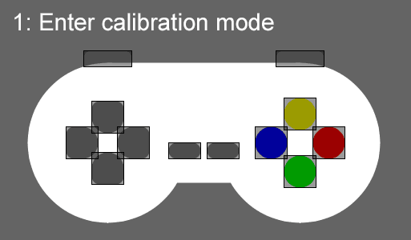

# p5.joystick.js


## Overview

The **p5.joystick** library aims to facilitate integration with physical Joysticks.

It also has an easy calibration system, allowing you to configure different types of joysticks with the standard button format.

This library uses the [gamepad API](https://developer.mozilla.org/en-US/docs/Web/API/Gamepad_API/Using_the_Gamepad_API).

Through them it is possible to read directly the status of each joystick. This library also make possible an event based approach.


## Installation 

It is necessary to insert p5.joystick.js in your html:
```js
<script src="js/p5.js"></script>
<script src="p5.joystick.js"></script>
<script src="sketch.js"></script>
```

### Usage

```js
var joystick;

function setup() {
  createCanvas(window.innerWidth, window.innerHeight);

  joystick = createJoystick();
  if(!joystick.calibrated())
    joystick.calibrate(true);
  joystick.onButtonPressed(onJoystick);
  joystick.onButtonReleased(onJoystick);
  joystick.onAxesPressed(onJoystick);
  joystick.onAxesReleased(onJoystick);
}

function draw(){
  background(100);
  joystick.draw(width/2, height/2);
}

function onJoystick(e) {
  console.log("onJoystick", e);
}
```

## Calibrating

Calibration associates each button on the virtual joystick with the physical joystick.
You can make different combinations as you wish.

The calibration is automatically saved and loaded into a cookie.




## Methods

### createJoystick([debug])

Initializes built-in listeners to integrate with gamepad API.

| Parameter | Type | Required | Description |
| -------- | -------- | -------- | -------- |
| debug | Boolean | No | If `true`, adds html elements to monitor all connected joysticks and the state of each button. |

### draw(x, y, [width], [height])

Draws a joystick on the screen in the desired position and size.

| Parameter | Type | Required | Description |
| -------- | -------- | -------- | -------- |
| x | Number | Yes | horizontal position on screen. |
| y | Number | Yes | vertical position on the screen. |
| width | Number | No | Width of the joystick. Standard value: 440. |
| height | Number | No | Height of the joystick. Standard value: 200. |

**Notice:** The drawing axis is centered, so the joystick is drawn around the x and y coordinates.

### calibrate(enable)

Enable/Disable calibration mode.

| Parameter | Type | Required | Description |
| -------- | -------- | -------- | -------- |
| enable | Boolean | Yes | Enable/Disable calibration mode. |

### getButtonPressedByName(name)

Returns a boolean button state: `true` or `false`.


| Parameter | Type | Required | Description |
| -------- | -------- | -------- | -------- |
| gamepadIndex | Integer | Yes | Joystick index. |
| name | String | Yes | Button name: sholderLeft, sholderRight, axesUp, axesDown, axesLeft, axesRight, buttonBlue, buttonYellow, buttonRed, buttonGreen, start or select. |

**Notice:** Only works when calibrated.

### getButtonPressedByIndex(gamepadIndex, buttonIndex)

Returns a boolean button state: `true` or `false`.

| Parameter | Type | Required | Description |
| -------- | -------- | -------- | -------- |
| gamepadIndex | Integer | Yes | Joystick index. |
| buttonIndex | Integer | Yes | Button index. |

### getAxesValueByIndex(gamepadIndex, axesIndex)

Returns a integer axis state: `-1`, `0`, `1`.

| Parameter | Type | Required | Description |
| -------- | -------- | -------- | -------- |
| gamepadIndex | Integer | Yes | Joystick index. |
| axesIndex | Integer | Yes | Axes index. |

## Events

Events return an object with the following properties:

| Property | Type | Description |
| -------- | -------- | -------- |
| gamepadName | String | Joystick name. |
| gamepadIndex | Integer | Joystick index. |
| index | Integer | Button index. |
| name | String | Button name: sholderLeft, sholderRight, axesUp, axesDown, axesLeft, axesRight, buttonBlue, buttonYellow, buttonRed, buttonGreen, start or select. Return empty "" if the joystick is not calibrated. |
| pressed | Boolean | Button is pressed or not. |
| type | String | Button type: axes or button. |
| value | Integer | "axes" can return directions -1, 0 or 1, and buttons can return 0 or 1. |

There are 4 types of events:

### onButtonPressed

Triggered when a button is pressed.
```js
joystick.onButtonPressed(function(eventObj){});
```

### onButtonReleased

Triggered when a button is released.
```js
joystick.onButtonReleased(function(eventObj){});
```

### onAxesPressed

Triggered when an axes is pressed.
```js
joystick.onAxesPressed(function(eventObj){});
```

### onAxesReleased

Triggered when an axes is released.
```js
joystick.onAxesReleased(function(eventObj){});
```